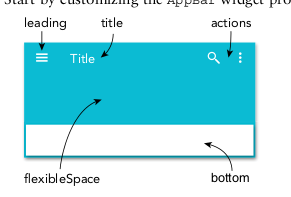

# Basic Widgets

1. Scaffold - this is the basic material design visual layout that allows you add various widgets i.e AppBar, BottomAppBar, FloatingActionButton, Drawer, SnackBar, BottomSheet
2. AppBar - widget usually contains the standard title, toolbar, leading and action properties
   
   
   
   1. title - it is implemented with a text widget
   2. leading - it is displayed before the title property usually an IconButton or BackButton
   3. actions - it is displayed to the right of the title property It’s a list of widgets aligned to the upper right of an AppBar widget usually with an IconButton or PopupMenuButton.
   4. flexibleSpace - The flexibleSpace property is stacked behind the Toolbar or TabBar widget. The height is usually the same as the AppBar widget’s height. A background image is commonly applied to the flexibleSpace property, but any widget, such as an Icon, could be used.
3. safeArea - The SafeArea widget is necessary for today’s devices such as the iPhone X or Android devices with a notch (a partial cut-out obscuring the screen usually located on the top portion of the device). The SafeArea widget automatically adds sufficient padding to the child widget to avoid intrusions by the operating system. You can optionally pass a minimum amount of padding or a Boolean value to not enforce padding on the top, bottom, left, or right
4. Container - The Container widget is a commonly used widget that allows customization of its child widget. You can easily add properties such as color, width, height, padding, margin, border, constraint, alignment, transform (such as rotating or sizing the widget), and many others. The child property is optional, and the Container widget can be used as an empty placeholder (invisible) to add space between widgets.
5. Text - The Text widget is used to display a string of characters. The Text constructor takes the arguments string, style, maxLines, overflow, textAlign, and others. A constructor is how the arguments are passed to initialize and customize the Text widget.
6. RichText - The RichText widget is a great way to display text using multiple styles. The RichText widget takes TextSpans as children to style different parts of the strings
7. Column - A Column widget displays its children vertically. It takes a children property con- taining an array of List<Widget>, meaning you can add multiple widgets. The children align vertically without taking up the full height of the screen. Each child widget can be embedded in an Expanded widget to fill the available space. CrossAxisAlignment, MainAxisAlign­ment, and MainAxisSize can be used to align and size how much space is occupied on the main axis.
8. Row - A Row widget displays its children horizontally. It takes a children property containing
an array of List<Widget>. The same properties that the Column contains are applied to the
Row widget with the exception that the alignment is horizontal, not vertical.
1. Buttons - There are a variety of buttons to choose from for different situations such as RaisedButton, FloatingActionButton, FlatButton, IconButton, PopupMenuButton, and ButtonBar.

## containers widget

The Container widget has an optional child widget property and can be used as a decorated widget
with a custom border, color, constraint, alignment, transform (such as rotating the widget), and more.
This widget can be utilized as an empty placeholder (invisible), and if a child is omitted, it sizes to the
full available screen size

## safeAreaWidget

Adding the SafeArea widget automatically adjusts padding for devices that have a notch. Any SafeArea
child widgets are constrained to the correct padding.

## Textwidget

Text widgets can be customized using `style: TextStyle()`

The Text constructor takes the arguments string, style, maxLines, overflow, text­
Align, and others.

```dart
Text(
   'Flutter World for Mobile',
   style: TextStyle(
      fontSize: 24.0,
      color: Colors.deepPurple,
      decoration: TextDecoration.underline,
      decorationColor: Colors.deepPurpleAccent,
      decorationStyle: TextDecorationStyle.dotted,
      fontStyle: FontStyle.italic,
      fontWeight: FontWeight.bold,
   ),
   maxLines: 4,
   overflow: TextOverflow.ellipsis,
   textAlign: TextAlign.justify,
),
```

## RichText Widgets

The RichText widget is a great way to display text using multiple styles. The RichText widget takes
TextSpan as children to style different parts of the strings

## column widgets

A column widget displays its children vertically

it takes a children property containing an array of `List<Widget>`

the children align vertically without taking up the full height of the screen

Each widget can be embedded in `Expanded` Widget to fill available space.

you can use `CrossAxisAlignment`, `MainAxisAlignment` and `MainAxisSize` properties to align and size how much space is occupied on the main axis.

```dart
Column(
   crossAxisAlignment: CrossAxisAlignment.center,
   mainAxisAlignment: MainAxisAlignment.spaceEvenly,
   mainAxisSize: MainAxisSize.max,
   children: <Widget>[
      Text('column 1'),
      Text('column 2'),
      Text('column 3'),
   ]
)
```

## Row widgets

A row widget displays its children horizontally, it takes a children property containing an array of `List<Widget>`

## Buttons

there are variety of button widgets to choose from

1. Floating action buttons - `FloatingActionButton`
2. Flat button - `FlatButton`
3. Icon button - `IconButton`
4. raised button - `RaisedButton`
5. Popup menu button - `PopupMenuButton`
6. Button Bar - `ButtonBar`

### floating action buttons

The FloatingActionButton widget is usually placed on the bottom right or center of the main
screen in the Scaffold floatingActionButton property. 

Use the FloatingActionButtonLocation widget to either dock (notch) or float above the navigation bar. 

To dock a button to the navigation bar, use the BottomAppBar widget. 

By default, it’s a circular button but can be customized to a stadium shape by using the named constructor FloatingActionButton.extended. In the example
code

### FlatButton widgets

The FlatButton widget is the most minimalist button used; it displays a text label without any
borders or elevation (shadow). Since the text label is a widget, you could use an Icon widget instead
or another widget to customize the button. color, highlightColor, splashColor, textColor, and
other properties can be customized.

### RaisedButton widgets

The RaisedButton widget adds a dimension, and the elevation (shadow) increases when the user
presses the button.

### IconButton widgets

The IconButton widget uses an Icon widget on a Material Component widget that reacts to touches
by filling with color (ink). The combination creates a nice tap effect, giving the user feedback that an
action has started.

### PopupMenuButton widgets

The PopupMenuButton widget displays a list of menu items. When a menu item is pressed, the value passes to the onSelected property. 

A common use of this widget is placing it on the top right of the AppBar widget for the user to select different menu options. 

Another example is to place the Popup­ MenuButton widget in the middle of the AppBar widget showing a list of search filters.

### ButtonBar widgets

this allows you to buttons horizontally

the icons are passed as children attributes:

```dart
...
children: <Widget>[

]
...
// basically:
Container(
   color: Colors.green.shade100,
   child: ButtonBar(
      alignment: MainAxisAlignment.spaceEvenly,
      children: <Widget>[
         icon: Icon(Icons.map, onPressed: () {})
         icon: Icon(Icons.brush, onPressed: () {})
         icon: Icon(Icons.airport_shuttle, onPressed: () {})
      ]
   )
)
```

The FloatingActionButton, FlatButton, RaisedButton, IconButton, PopupMenuButton, and ButtonBar widgets are configurable by setting the properties icon, iconSize, tooltip, color, text, and more.

